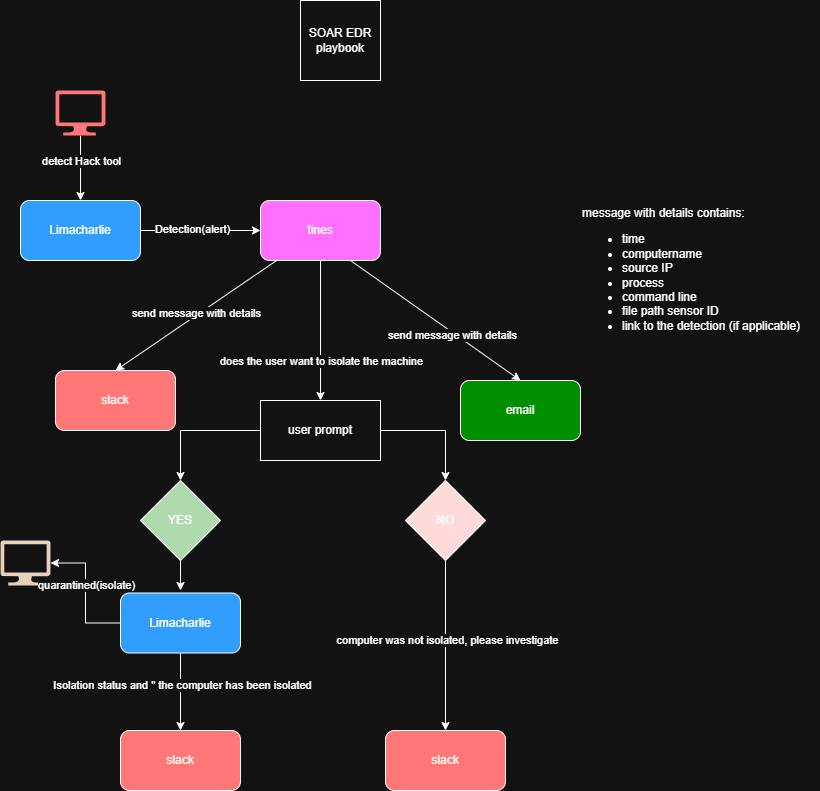
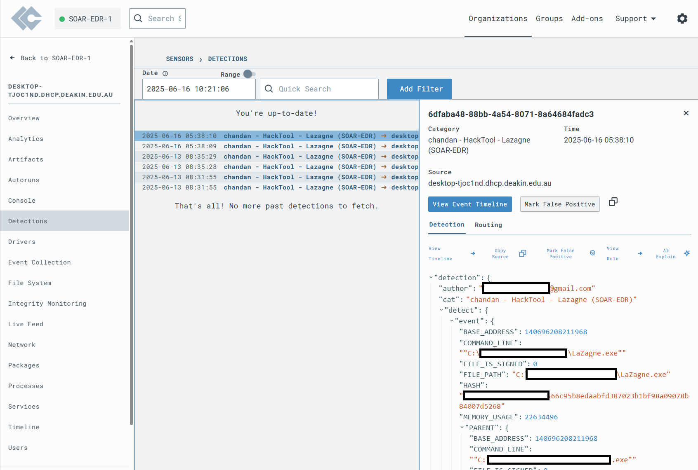
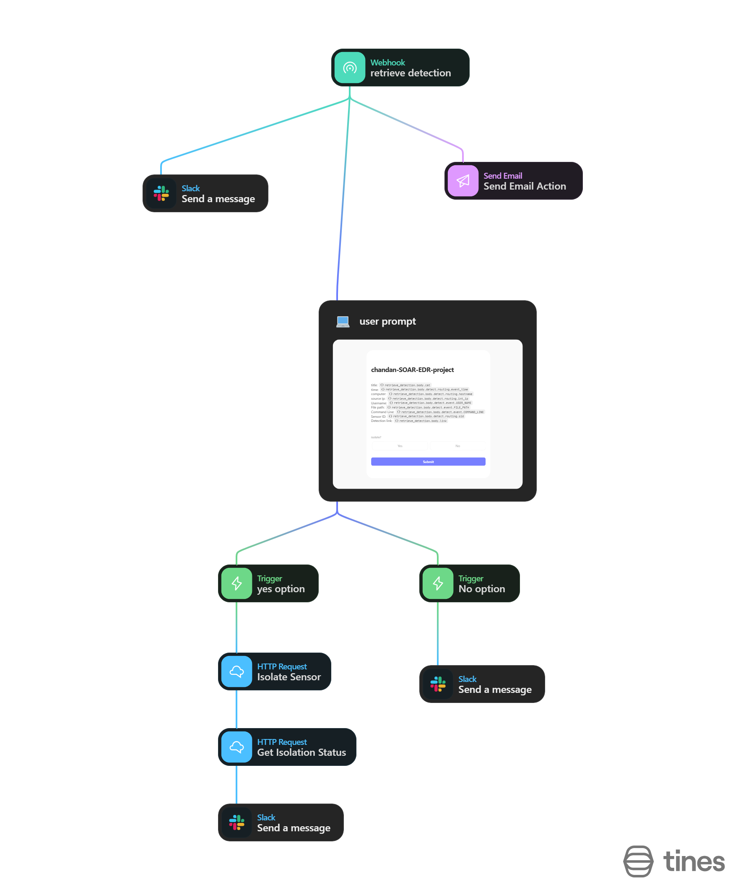
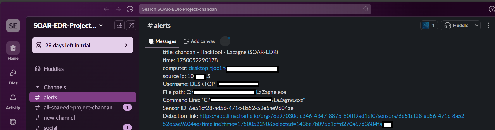
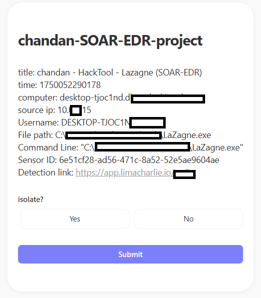
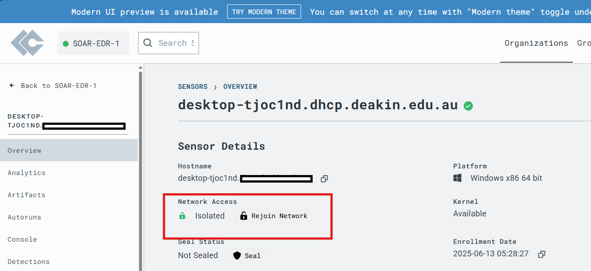
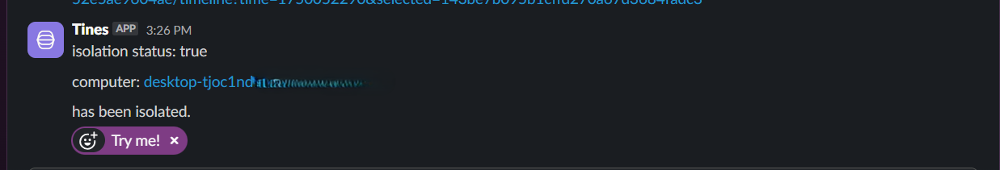

# Cybersecurity SOAR-EDR Automation Project

## Project Overview

This project demonstrates the practical application of Security Orchestration, Automation, and Response (SOAR) and Endpoint Detection and Response (EDR) by building an end-to-end automated workflow. The goal was to detect the use of a specific "hack tool" (password recovery tool like `lazagne.exe`) on a monitored endpoint and automate the alerting and response process.

The project utilized a **Windows Virtual Machine** in a lab environment, demonstrating the ability to apply EDR/SOAR concepts to various endpoint deployments.

**Key Technologies & Tools Used:**

*   **SOAR Platform:** Tines
*   **EDR Solution:** LimaCharlie
*   **Endpoint Agent:** LimaCharlie agent deployed on a Windows Virtual Machine
*   **Communication/Alerting:** Slack, Email
*   **Workflow Design:** draw.io
*   **Configuration:** YAML

## Project Workflow

The following diagram outlines the automated incident response workflow implemented:

## Implementation Details

This project involved several key phases:

1.  **Endpoint Setup & Monitoring:**
    *   Configured and deployed a Windows Virtual Machine to simulate an endpoint.
    *   Installed and configured the LimaCharlie EDR agent on the VM to collect endpoint telemetry.
    *   Verified successful telemetry ingestion in the LimaCharlie platform.

2.  **Custom Threat Detection:**
    *   Created a custom Detection & Response (D&R) rule in LimaCharlie using YAML.
    *   The rule was designed to detect the execution of the `lazagne.exe` password recovery tool based on process creation events, command line arguments, file path, and specific file hash values. This demonstrated the ability to define specific security events of interest.
    *   Tested and validated the detection rule by executing the tool on the monitored VM.

3.  **SOAR Playbook Development (Tines Story):**
    *   Built a multi-step automation "Story" (playbook) in the Tines SOAR platform.
    *   Configured a webhook in Tines to receive detection alerts from LimaCharlie in real-time.
    *   The playbook was designed to:
        *   Ingest and parse the incoming EDR detection data.
        *   Extract relevant details (hostname, IP, user, process, command line, detection link).
        *   Send immediate alerts containing these details to a designated SOC Slack channel and an email address, providing analysts with actionable information.
        *   Present a dynamic user prompt (via a Tines Page action) to the analyst, displaying the alert details and asking for approval to isolate the endpoint.
        *   Implement conditional logic (using Tines Triggers) based on the analyst's "Yes" or "No" response.
    *   If the analyst approved ("Yes"), the playbook automatically initiated an API call to LimaCharlie to isolate the affected endpoint, preventing further potential compromise.
    *   If the analyst declined ("No"), the playbook notified the Slack channel, indicating manual investigation was required.
    *   The playbook concluded by sending a final confirmation message to Slack indicating the isolation status.

4.  **Integration & Orchestration:**
    *   Established secure API connections between Tines, LimaCharlie, and Slack by configuring credentials and integrations.
    *   Configured LimaCharlie's output streams to automatically forward `Detection` events to the Tines webhook.

## Demonstration Screenshots

Visualize the workflow execution:

*   **LimaCharlie Detection Triggered:**
    

*   **tines playbook overview:**
    

*   **Automated Slack Alert:**
    

*   **Analyst User Prompt (in Tines or linked from notification):**

    

*   **Endpoint Isolation Confirmed in LimaCharlie:**
    

*   **Final Isolation Status Update in Slack:**

    

## Project Artifacts

*   [LimaCharlie `lazagne.exe` Detection Rule (YAML)](detection_rules/limacharlie_lazagne_rule.yaml)
*   [Tines Playbook/Story Export (JSON)](tines_playbooks/tines_lazagne_playbook.json)

## Skills Demonstrated

This project allowed me to gain hands-on experience and demonstrate skills in:

*   Security Orchestration, Automation, and Response (SOAR)
*   Endpoint Detection and Response (EDR) operations
*   Designing and building automated security workflows/playbooks
*   Integrating disparate security tools via APIs and webhooks
*   Developing custom detection logic (YAML rule creation)
*   Incident Response process automation
*   Endpoint isolation techniques
*   Working with security telemetry
*   Cloud/Virtual Machine setup for lab environments

## Lessons Learned

Key takeaways from this project included understanding the importance of:
*   Clear workflow design before building automation.
*   Thorough testing of detection rules and playbook logic.
*   Securely managing API credentials.
*   How automation can significantly reduce repetitive tasks and response times in a SOC environment.
